# Design Document

### SDPVocab Application
**Author**: Derek Megyesi

## 1 Design Considerations
### 1.1 Assumptions
1. The software is designed to help students study vocabulary terms for their classes and challenge one another. This software is going to be used in classroom settings. 
2. The software will run on a single device, which will be passed around to other students.
3. The software should run on an original android system.
4. Students are allowed to sign up by themselves, without the permission of professor.
5. The data should be accessible after the program restarts.

### 1.2 Constraints
1. The need of computing power and storage should not exceed that of a single android device.
2. The software should be power saving.

### 1.3 System Environment
The software is designed to run on Android 6.0(Marshmallow API level 23) and above.

## 2 Architectural Design
### 2.1 Component Diagram
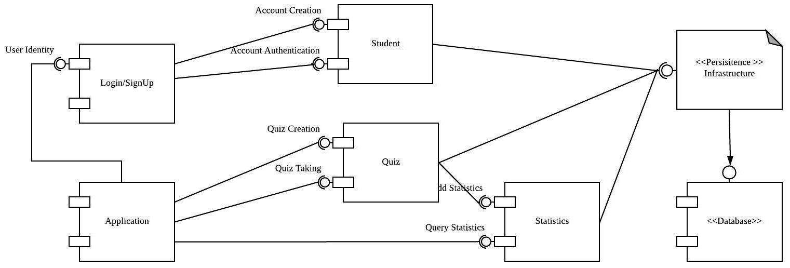
#### The software is composed of 7 components: 
a. *Login/SignUp*: For signing in and signing up. 
b. *Application*: Enables the quiz taking, quiz creation and statistics presenting. 
c. *Students*: Provides student account authentication and creation. 
d. *Quiz*: For quiz taking and creation. 
e. *Statistics*: Processing and presenting quiz statistics. 
f. *Infrastructure*: Code that queries the database. 
g. *Database*: Stores the application data. 

### 2.2 Deployment Diagram
This is an app deployed on one system -- the Android phone, a single system -- so no other systems are in play, hence no deployment diagram is needed at this time.

## 3 Low-Level Design
### 3.1 Class Diagram
### UML Design
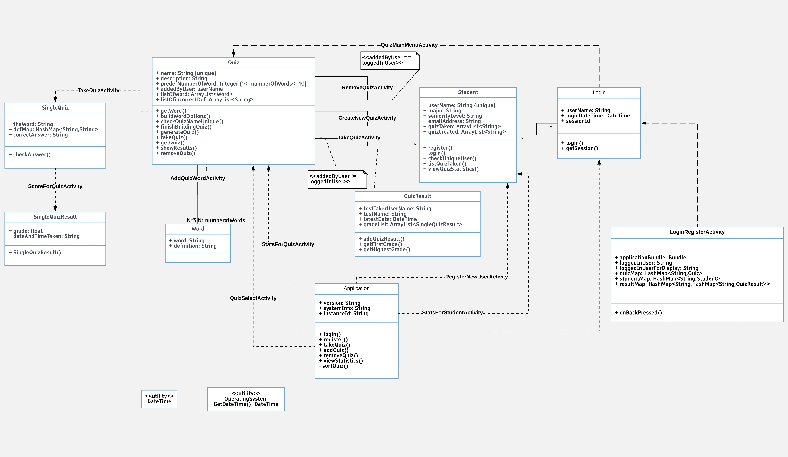

### 3.2 Other Diagrams
### Flow diagram
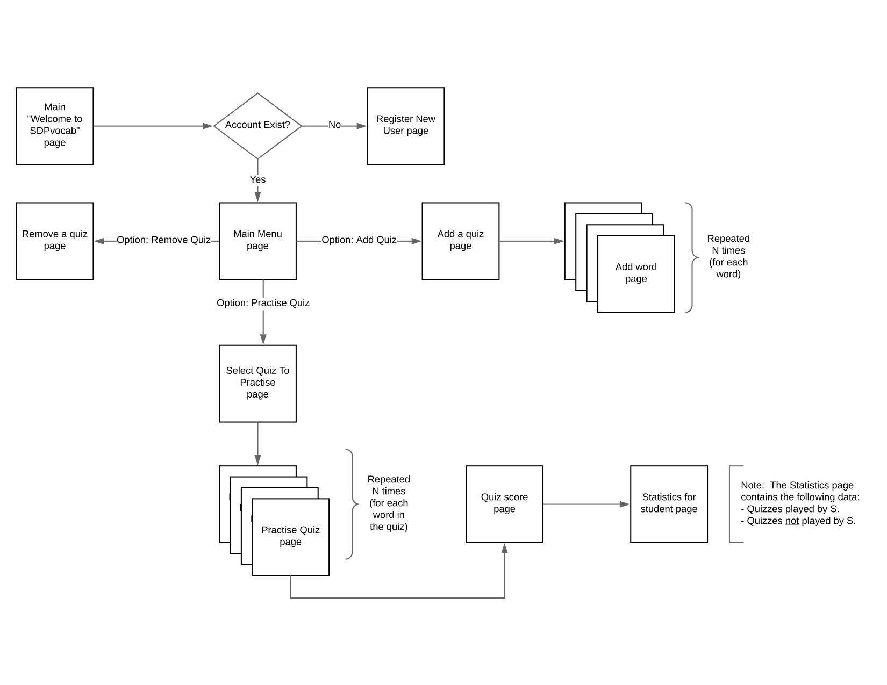

## 4 User Interface Design
### Login / Register
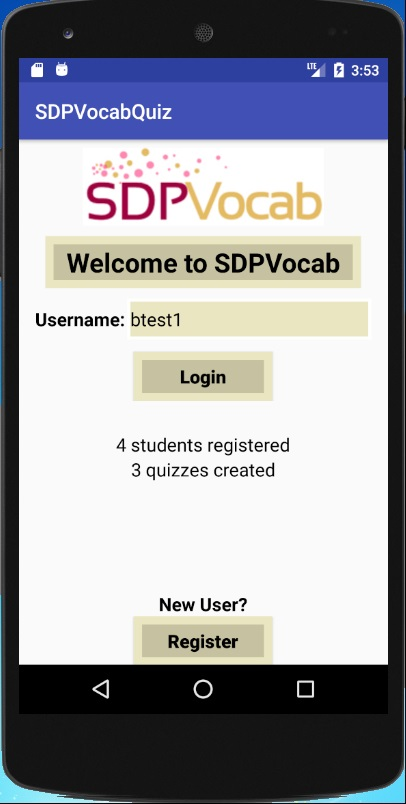
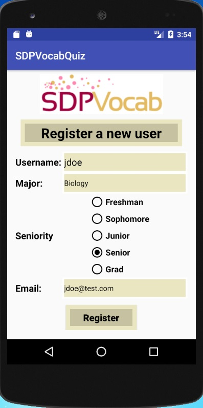

### Create Quiz
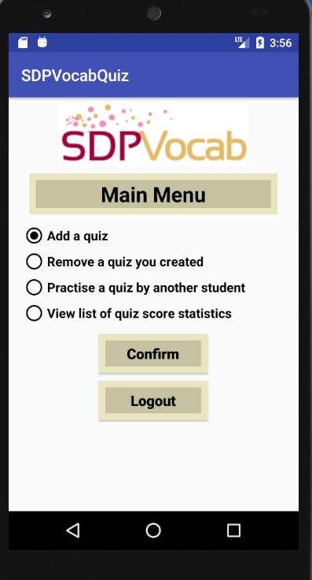
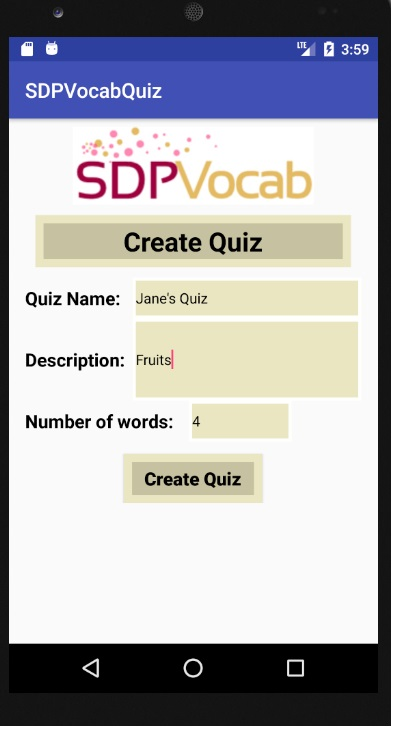
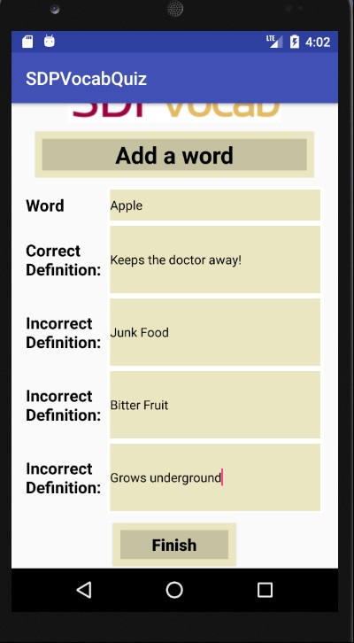

### Remove Quiz
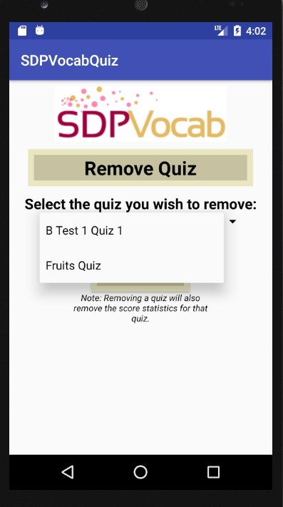

### Practise Quiz
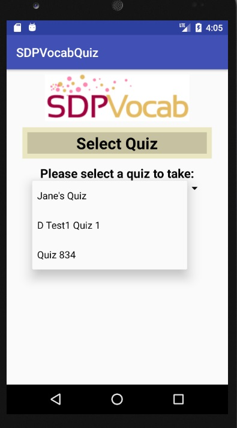

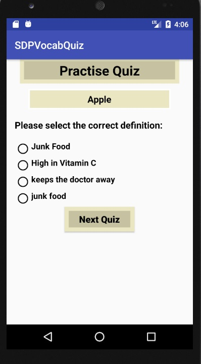

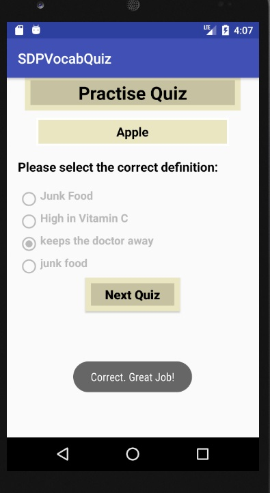

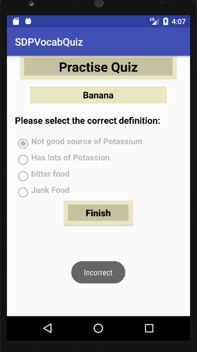

### Scores / Statistics

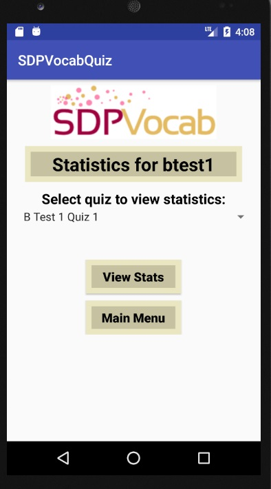
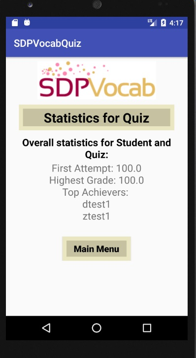