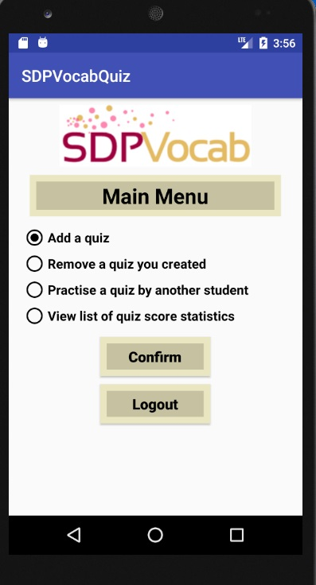
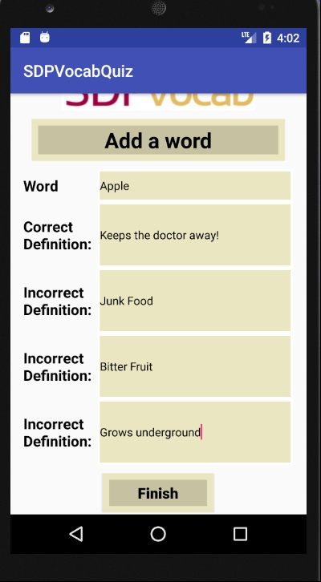
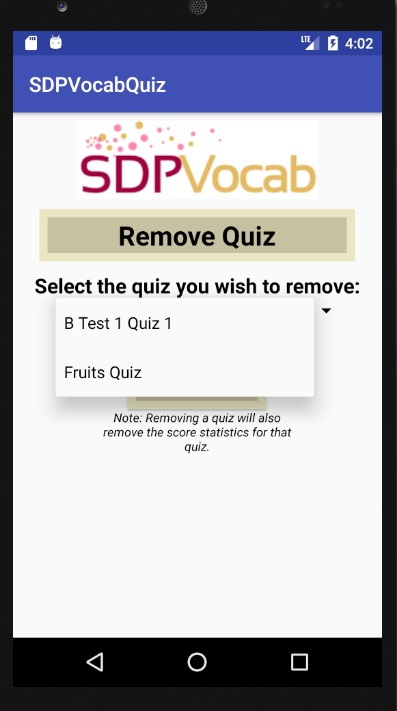
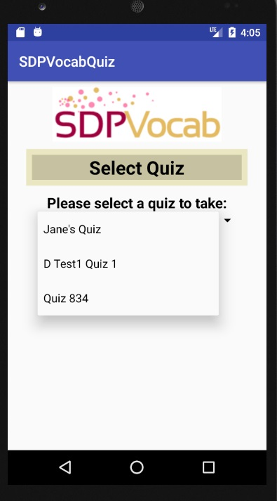
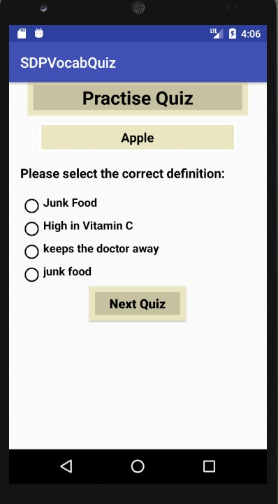
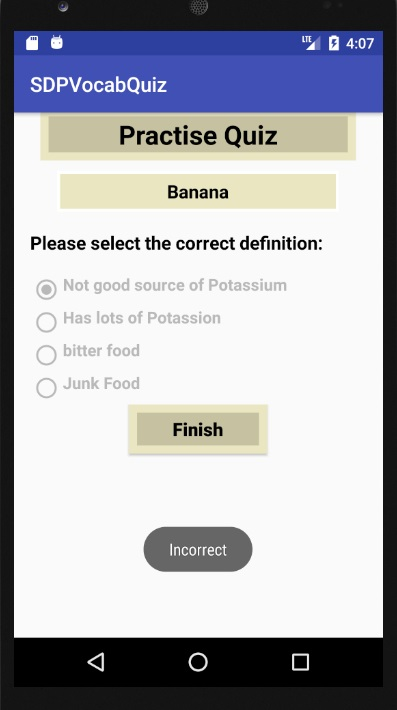
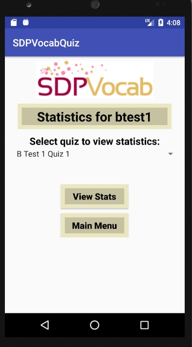
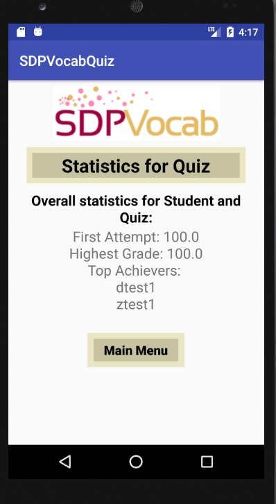

# User Manual for the SDPVocabQuiz application


## About the App

This Android application is intended for students to practise taking vocabulary quizzes.  Students can either take quizzes created by other students, or create their own quiz to be taken by other students.  The application will also keep track of quiz score statistics by student, and by quiz.


## Version History

| #    | Author(s) | Comments                                                     |
| ---- | ------- | ------------------------------------------------------------ |
| 1.0  | Derek Megyesi  | Initial Draft of the User Manual                             |
| 1.1  | Derek Megyesi   | Updated Screen Shots and reviewed for User Manual content flow |
| 1.2  | Derek Megyesi   | Added detailed instructions for using Login and Register Screens; Reviewed by Team |
| 1.3  | Derek Megyesi  | Added detailed instructions for all screens in the app       |
| 1.4  | Derek Megyesi  | Added Reference section and included link to Design documentation       |


## Getting Started

These instructions will explain how to clone a copy of the project up and running on your local machine.

### Prerequisites

* Android Studio

### Installing

* Project location is on Github. Clone the [remote master repo. ] (https://github.com/derekmegyesi/SDPVocab.git)
* Install Android Studio Version 3.0.1 (located at [Android Studio).] (https://developer.android.com/studio/index.html)
* Select API 23: Android 6.0 (Marshmallow) x86 as the target version. Suggested device is a Nexus 5/5X.

## Running the SDPVocab application
* Launch Android Studio and open the project in the below directory:
	
```
./SDPVocab/SDPVocabQuiz
```
* Run the project by pressing ^R (Control-R).
* If running the application for the first time, the Android AVD manager will launch and prompt the user to create a virtual device.  The Nexus 5/5X is recommended as the application is streamlined for this device.
* The SDPVocab application will be launched in the chosen emulator.

## User Guide
### Login / Register

This is the first screen that is shown once the application is launched on mobile device. The User has two options to proceed here:

1. **Login:** Enter his/her username and login into the app to use it
2. **Register:** If the user is using the app for first time, it allows one to Register and start using it


On Clicking Register, the Registration Details Page is shown below:


On this Register Page, specify the following:

1. Username - it has be unique - if already in use, you will be prompted about that
2. Major Subject - the subject you are specializing in such as Biology or Computer Science.
3. Seniority - the year you are studying in - select one from the radio options
4. Email Address - enter your email address you would like to use for communication.

After specifying above details, click the Register button to be registered as a New User and start using the app.  


### Main Menu

After successfully Registering or Logging Into the system, the user is presented with the Main Menu:

1. Add Quiz
2. Remove Quiz
3. Practice Quiz
4. View Statistics



### Add Quiz

Selecting this Menu option, brings the user to the "Add a Quiz" screen shown below:


Specify the details about the Quiz in the above screen:

1. Quiz Name
2. Description of the Quiz
3. How many words will be in the Quiz - A Number Spinner allows you to easily select the number of words here.

The next screen shown below, allows you to define each Word in the Quiz with it's correct and incorrect definitions.




### Remove Quiz

The Remove Quiz Main Menu options brings the User to a list of Quizzes created by the User. You cam select one Quiz at a time and Delete it.




### Practice Quiz

The Practice Quiz Main Menu options allows the User to see a list of All Available Quizzes for practicing. Note that you will not see your quizzes in this list.



Select a particular Quiz to take it. The screen below is what allows a User to practice a Quiz. It shows the first word in the Quiz and the Answer Options.



Selecting one of the options, displays at the bottom of the Screen whether you chose the correct word definition or not. Screen below shows a correct answer.


Screen below shows an incorrect answer:



Answering all the questions i.e. Words in the Quiz takes you back to the Main Menu.


### Scores / Statistics

The Scores Main Menu allows the User to view the various key Statistics about a Quiz. Select a Quiz from the list of Quizzes to see its key statistics.



It shows the statistics breakdown by:

1. Quizzes practiced by the User
2. Quizzes not practiced by the User
3. Top Scorers for a particular Quiz.



## References
* SDP Vocab Quiz Design [DesignDocument.md](https://github.com/derekmegyesi/SDPVocab/blob/master/DesignDocument.md)
